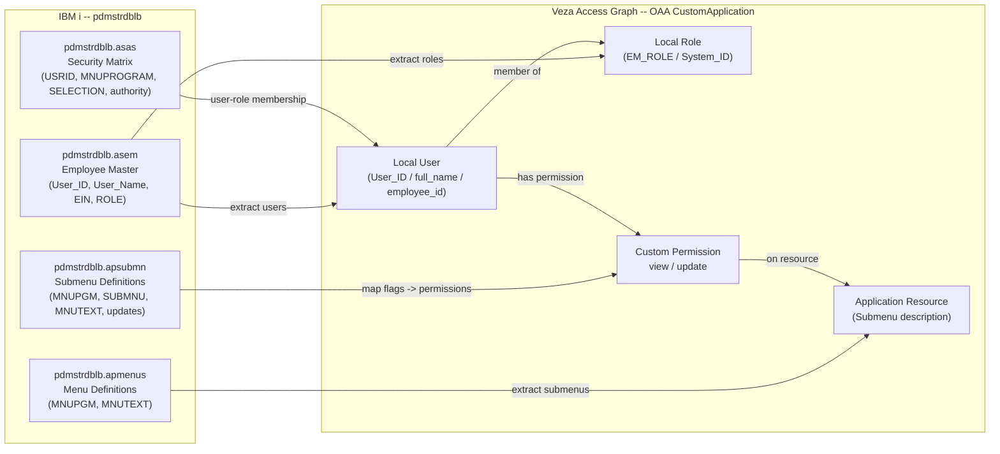

# Board Sales Invoicing IBM i -> Veza OAA Connector

Connects to the IBM i system configured via `DB_URL` via JDBC (IBM Toolbox for Java,
driver `com.ibm.as400.access.AS400JDBCDriver`) and pushes user, role, and menu-permission
data into Veza's Access Graph using the OAA CustomApplication template.

---

## 1. Overview

| IBM i Source | OAA Entity | Description |
|---|---|---|
| `pdmstrdblb.asem` (active employees) | **Local User** | User ID, full name, employee ID |
| `pdmstrdblb.asem.EM_ROLE` | **Local Role** | System/Role code assigned to each employee |
| `pdmstrdblb.apmenus` + `pdmstrdblb.apsubmn` | **Application Resource** | Menu/submenu entries the user can access |
| `sec.authority='Y' AND sub.updates='Y'` -> `*UPDATE*` prefix | **Custom Permission: `update`** | DataRead + DataWrite |
| All other menu entries | **Custom Permission: `view`** | DataRead only |

**Permission mapping:**

| OAA Custom Permission | OAA Standard Permissions | When Applied |
|---|---|---|
| `view` | `DataRead` | User has access to a submenu without update rights |
| `update` | `DataRead`, `DataWrite` | Submenu description starts with `*UPDATE*` |

---

## 2. Entity Relationship Map



---

## 3. How It Works

1. Reads credentials from `.env` (or CLI args / environment variables).
2. Opens a JDBC connection using `com.ibm.as400.access.AS400JDBCDriver` via `jt400.jar`.
3. Runs the **Account query** (Query 1) — active employees with role and menu/submenu access.
4. Runs the **Access query** (Query 3) — distinct submenu resource names.
5. Runs the **System_ID query** (Query 4) — distinct `EM_ROLE` / System_ID codes.
6. Builds a `CustomApplication` OAA payload.
7. Pushes the payload to Veza via `OAAClient.push_application()`.

---

## 4. Prerequisites

| Requirement | Notes |
|---|---|
| Python 3.9+ | `python3 --version` |
| Java JRE 8+ | Required by jaydebeapi/JPype1; `java -version` |
| JT400 JAR (`jt400.jar`) | [Maven Central](https://repo1.maven.org/maven2/net/sf/jt400/jt400/) or [SourceForge](https://sourceforge.net/projects/jt400/files/) |
| Network access to IBM i host | TCP ports 449 and 8471 must be reachable |
| IBM i user profile | Must have `*USE` authority to `pdmstrdblb` library |
| Veza tenant + API key | Generated in Veza Settings -> API Keys |

---

## 5. Quick Start

```bash
curl -fsSL https://raw.githubusercontent.com/<your-github-org>/Board-Sales-Invoicing/main/integrations/board-sales-invoicing/install_board-sales-invoicing.sh | bash
```

The installer will:
- Check/install prerequisites (git, python3, Java)
- Download `jt400.jar` from Maven Central if not present
- Prompt for the Git repository URL
- Clone and install integration files
- Strip CRLF line endings from all scripts
- Create a Python virtual environment and install dependencies
- Prompt for IBM i JDBC URL, credentials, and Veza credentials
- Write a `chmod 600` `.env` file

---

## 6. Manual Installation

### RHEL / CentOS / Amazon Linux

```bash
sudo dnf install -y git python3 python3-pip java-11-openjdk-headless

# Download JT400 JAR
sudo mkdir -p /opt/jt400
sudo curl -fsSL -o /opt/jt400/jt400.jar \
    https://repo1.maven.org/maven2/net/sf/jt400/jt400/20.0.7/jt400-20.0.7.jar

git clone https://github.com/<your-github-org>/Board-Sales-Invoicing.git
cd Board-Sales-Invoicing/integrations/board-sales-invoicing
python3 -m venv venv
venv/bin/pip install -r requirements.txt

cp .env.example .env && chmod 600 .env
vi .env   # fill in DB_URL, DB_USER, DB_PASSWORD, JDBC_JAR, VEZA_URL, VEZA_API_KEY
```

### Ubuntu / Debian

```bash
sudo apt-get update
sudo apt-get install -y git python3 python3-pip python3-venv openjdk-11-jre-headless

sudo mkdir -p /opt/jt400
sudo curl -fsSL -o /opt/jt400/jt400.jar \
    https://repo1.maven.org/maven2/net/sf/jt400/jt400/20.0.7/jt400-20.0.7.jar

git clone https://github.com/<your-github-org>/Board-Sales-Invoicing.git
cd Board-Sales-Invoicing/integrations/board-sales-invoicing
python3 -m venv venv
venv/bin/pip install -r requirements.txt

cp .env.example .env && chmod 600 .env
nano .env
```

---

## 7. Configuration (`.env`)

| Variable | Required | Description |
|---|---|---|
| `DB_URL` | Yes | JDBC URL, e.g. `jdbc:as400://hostname/PDMSTRDBLB;naming=sql;date format=iso` |
| `DB_USER` | Yes | IBM i user profile |
| `DB_PASSWORD` | Yes | IBM i user profile password |
| `JDBC_JAR` | Yes | Absolute path to `jt400.jar` |
| `VEZA_URL` | Yes | Veza tenant URL (no trailing slash) |
| `VEZA_API_KEY` | Yes | Veza API key |
| `PROVIDER_NAME` | No | Provider label in Veza (default: `Board Sales Invoicing`) |
| `DATASOURCE_NAME` | No | Datasource label in Veza (default: `board-sales-invoicing`) |

---

## 8. Usage

### CLI Arguments

| Argument | Env var | Default | Description |
|---|---|---|---|
| `--env-file` | -- | `.env` | Path to credentials file |
| `--db-url` | `DB_URL` | -- | IBM i JDBC URL |
| `--db-user` | `DB_USER` | -- | IBM i user profile |
| `--db-password` | `DB_PASSWORD` | -- | IBM i password |
| `--jdbc-jar` | `JDBC_JAR` | -- | Absolute path to jt400.jar |
| `--veza-url` | `VEZA_URL` | -- | Veza tenant URL |
| `--veza-api-key` | `VEZA_API_KEY` | -- | Veza API key |
| `--provider-name` | `PROVIDER_NAME` | `Board Sales Invoicing` | Provider label in Veza |
| `--datasource-name` | `DATASOURCE_NAME` | `board-sales-invoicing` | Datasource label in Veza |
| `--save-json` | -- | off | Save OAA payload JSON to disk |
| `--log-level` | -- | `INFO` | DEBUG / INFO / WARNING / ERROR |

### Examples

```bash
# Push to Veza using .env credentials
python3 board-sales-invoicing.py --env-file .env

# Override credentials inline
python3 board-sales-invoicing.py \
    --db-url "jdbc:as400://hostname/PDMSTRDBLB;naming=sql" \
    --db-user MYUSER \
    --db-password "S3cr3t!" \
    --jdbc-jar /opt/jt400/jt400.jar \
    --veza-url https://your-veza-host \
    --veza-api-key "vza_..." \
    --save-json

# Debug logging
python3 board-sales-invoicing.py --env-file .env --log-level DEBUG
```

---

## 9. Deployment on Linux

### Service account

```bash
sudo useradd -r -s /bin/bash -m -d /opt/board-sales-invoicing-veza board-sales-veza
sudo chown -R board-sales-veza:board-sales-veza /opt/VEZA/board-sales-invoicing-veza
sudo chmod 700 /opt/VEZA/board-sales-invoicing-veza/scripts
sudo chmod 600 /opt/VEZA/board-sales-invoicing-veza/scripts/.env
```

### Cron scheduling (daily at 2 AM)

```cron
0 2 * * * board-sales-veza cd /opt/VEZA/board-sales-invoicing-veza/scripts && \
    ./venv/bin/python3 board-sales-invoicing.py --env-file .env >> \
    /opt/VEZA/board-sales-invoicing-veza/logs/cron.log 2>&1
```

### Log rotation (`/etc/logrotate.d/board-sales-invoicing`)

```
/opt/VEZA/board-sales-invoicing-veza/logs/*.log {
    daily
    rotate 30
    compress
    missingok
    notifempty
    create 640 board-sales-veza board-sales-veza
}
```

---

## 10. Multiple Instances

```bash
python3 board-sales-invoicing.py --env-file .env.prod --datasource-name ibmi-prod
python3 board-sales-invoicing.py --env-file .env.qa   --datasource-name ibmi-qa
```

---

## 11. Security Considerations

- **`.env` file**: always `chmod 600` -- contains plaintext credentials.
- **Service account**: run as a dedicated non-root user with no login shell.
- **IBM i user profile**: grant only `*USE` authority to `pdmstrdblb` -- no DDL/DML beyond SELECT.
- **Veza API key**: rotate periodically in Veza Settings -> API Keys.
- **Network**: restrict outbound access to `<ibmi-host>:449,8471` and `<veza-host>:443`.

---

## 12. Troubleshooting

| Symptom | Likely Cause | Fix |
|---|---|---|
| `bash: import: command not found` | CRLF line endings in `.py` | `sed -i 's/\r$//' board-sales-invoicing.py` |
| `ClassNotFoundException: com.ibm.as400.access.AS400JDBCDriver` | Wrong/missing JAR | Verify `JDBC_JAR` path; re-download jt400.jar |
| `Connection refused` | Network blocked | Confirm TCP 449 and 8471 to IBM i are open |
| `HY000: User not authorized to library PDMSTRDBLB` | Missing authority | Grant `*USE` on `PDMSTRDBLB` to the user profile |
| `OAAClientError: 401` | Invalid Veza API key | Regenerate in Veza Settings -> API Keys |
| `ModuleNotFoundError: jaydebeapi` | venv not activated | `venv/bin/pip install -r requirements.txt` |
| `JVMNotFoundException` | Java not installed | `sudo dnf install java-11-openjdk-headless` |
| `No account rows returned` | No active employees visible | Check `emp.em_status = 'A'` rows exist and user has authority |

**Enable debug logging:**

```bash
python3 board-sales-invoicing.py --env-file .env --save-json --log-level DEBUG
```

---

## 13. Changelog

| Version | Date | Notes |
|---|---|---|
| 2.0.0 | 2026-07-16 | Full rewrite: JDBC/jaydebeapi connector; Java + JT400 JAR; no ODBC dependency |
| 1.0.0 | 2026-05-11 | Initial release (pyodbc/ODBC) |
